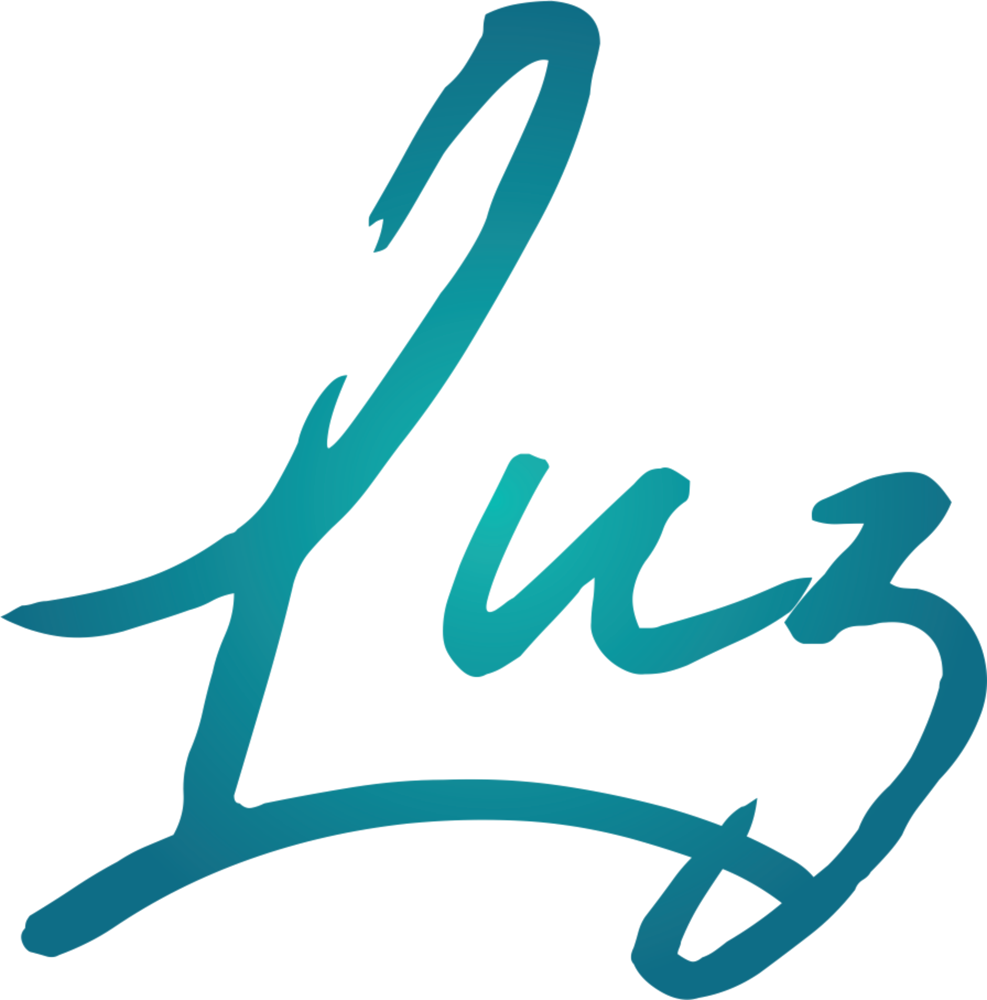

<!--
**guilhermeevencio/guilhermeevencio** is a ✨ _special_ ✨ repository because its `README.md` (this file) appears on your GitHub profile.

Here are some ideas to get you started:

- 🔭 I’m currently working on ...
- 🌱 I’m currently learning ...
- 👯 I’m looking to collaborate on ...
- 🤔 I’m looking for help with ...
- 💬 Ask me about ...
- 📫 How to reach me: ...
- 😄 Pronouns: ...
- ⚡ Fun fact: ...
-->
 

 <!--Foto de João  Jesus: https://www.pexels.com/pt-br/foto/janela-de-vidro-transparente-com-moldura-de-madeira-marrom-e-branca-921294/ -->
  
 

<h1 align="center">Hi 👋, I'm Guilherme Luz</h1>
<h3 align="center">I'm a Passionate Software Development Student from Brazil.</h3>
 

 &nbsp;
 

 

<h2 align="center">Languages and Tools</h2>

<!-- 
        -->

 
 

<h2 align="center">Connect with me!</h2>

 

